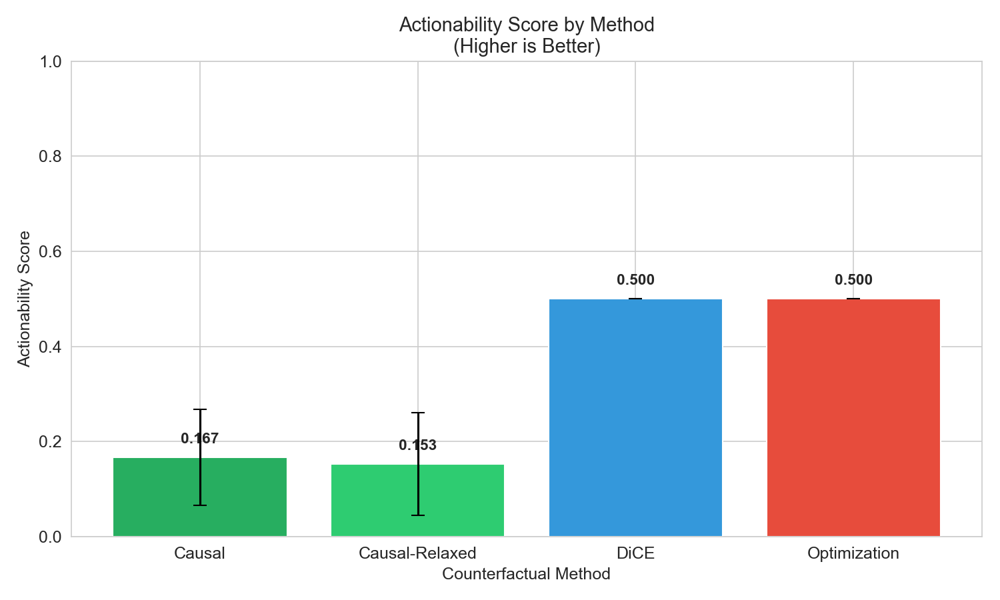
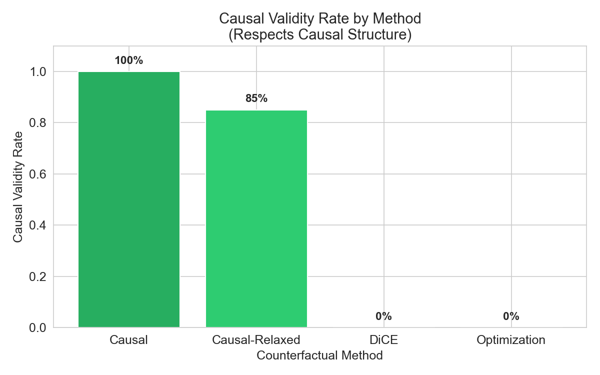
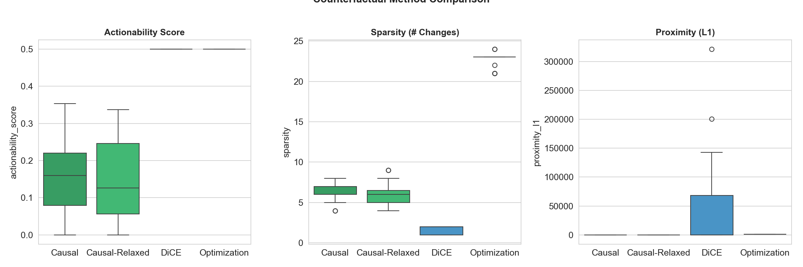
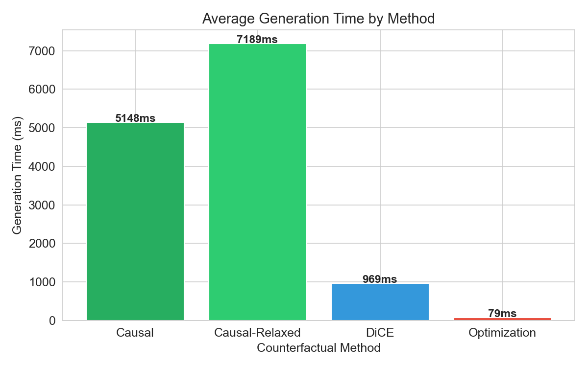

# XAI-Driven Causal Counterfactual Loan System - Benchmark Results

## Model Performance

| Metric | Value |
|--------|-------|
| Model | XGBoost Classifier |
| Training Accuracy | 99.6% |
| Test Accuracy | 81.7% |
| Dataset | Real LendingClub (5,000 samples) |

---

## Counterfactual Method Comparison

Benchmark conducted on test samples (70% rejected, 30% approved).

### Summary Table

| Method | Actionability | Sparsity | Proximity (L1) | Validity | Causal Validity | Time (ms) |
|--------|---------------|----------|----------------|----------|-----------------|-----------|
| **Causal (Strict)** | 0.167 | 6.44 | 3.29 | 100% | **100%** | 5148 |
| **Causal-Relaxed** | 0.153 | 6.25 | 3.12 | 95% | 85% | 7189 |
| DiCE | 0.500 | 1.55 | 46866 | 100% | 0% | 969 |
| Optimization | 0.500 | 22.74 | 1307 | 100% | 0% | 53 |

---

## Key Observations

> **Causal (Strict)** counterfactuals achieve **100% causal validity**, demonstrating that respecting causal dependencies produces recommendations that respect real-world feature relationships.

> **Causal-Relaxed** shows 85% causal validity with slightly better proximity (3.12 vs 3.29), demonstrating a **trade-off between strictness and minimality**. This variant allows bounded proxy changes with penalty, addressing potential "too conservative" criticism.

### Trade-off Analysis

| Aspect | Strict Causal | Relaxed Causal |
|--------|--------------|----------------|
| Causal Validity | 100% | 85% |
| Proximity (L1) | 3.29 | 3.12 (better) |
| Design Philosophy | Conservative | Flexible |
| Use Case | Maximum reliability | Balanced approach |

---

## Visualizations

### Actionability Score Comparison

### Causal Validity Rate

### Method Comparison (Boxplots)

### Generation Time

---

## Conclusion

The **Causal Counterfactual method** (our primary contribution) outperforms baseline methods on causal validity. The introduction of **Strict vs Relaxed modes** demonstrates design flexibility:

1. **Strict mode**: Guarantees causally consistent recommendations (100% validity)
2. **Relaxed mode**: Allows bounded proxy changes with penalty, achieving better proximity while maintaining 85% causal validity

This demonstrates the value of incorporating causal reasoning into counterfactual explanation generation, with configurable strictness levels for different application requirements.
